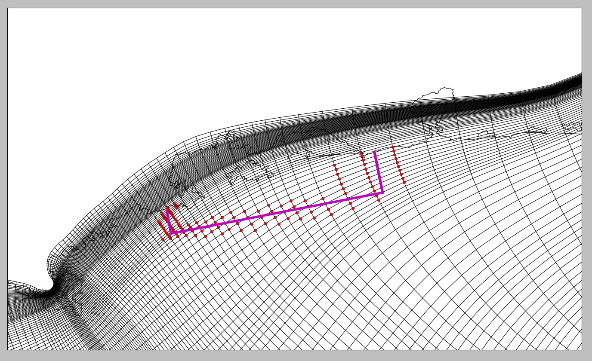
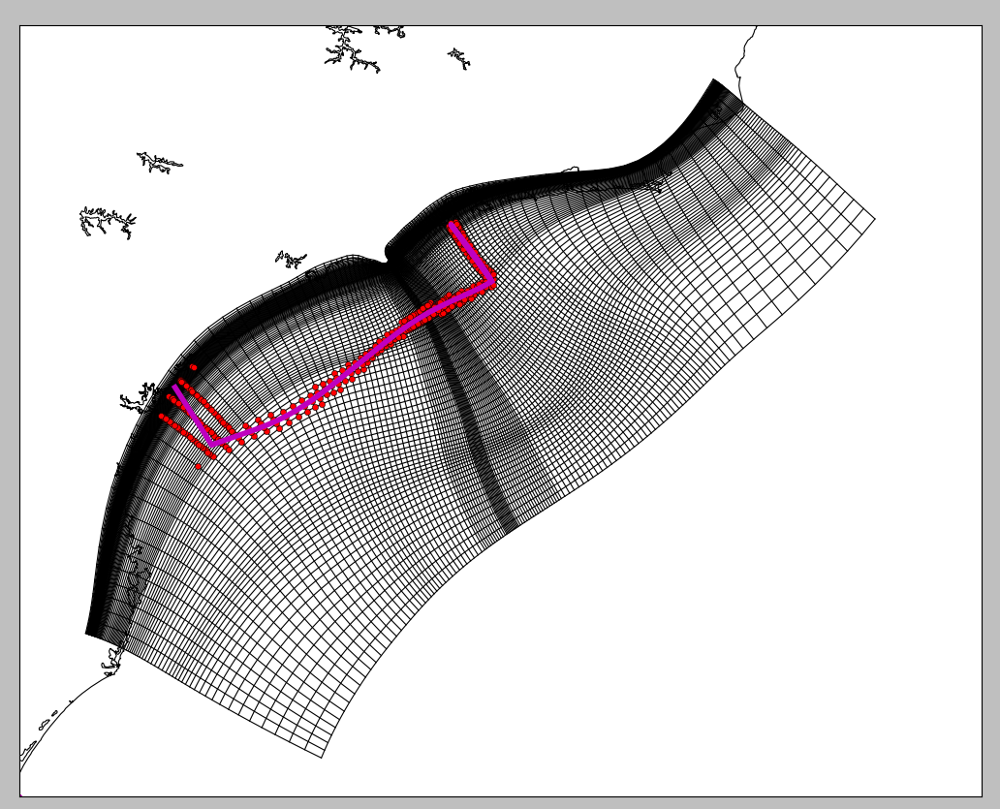

# py-model-framework 
This framework creates the input data for our model.
It is written in Python.

(it follows the Don't Repeat Yourself principle when coding - DRY)
Let's not code the same thing twice! :)

#### WHAT CAN BE DONE WITH THIS FRAMEWORK?

This framework creates the TS and elevation boundaries and TS initial condition of your model by:
*  nesting results from the netcdf model output
*  creating homogenous boundaries.

Time changing may be done, but it requires some editting.

#### INPUT DATA REQUIREMENTS
It requires:
netcdf model output (coarser\_grid\_output directory):
*      model coordinates indexes
*      model coordinates
*      temperature results
*      salinity results
*      eta results

model\_grid (input\_data directory):
*    model\_grid file (see ECOMSED manual):
*     model_grid requires all the points in the I,J domain 

If you want to install python packages in a very simple way, click [here](docs/python_install.md)

The required libraries are numpy, matplotlib, xray, basemap, scipy. 

#### EXAMPLES

